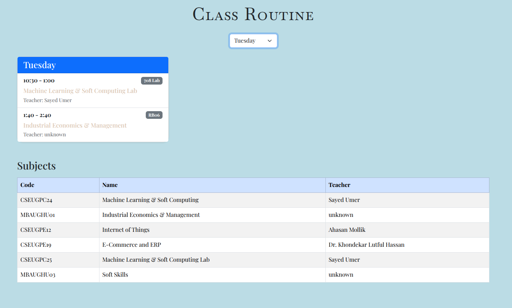

# Class Routine App

A beautiful and responsive class routine web app built with Node.js, Express, EJS, and Bootstrap.  
Easily view your weekly class schedule, select days, and see subject details. All routine data is managed via a simple JSON file.

---

## Preview



---

## Features

- **Responsive UI:** Clean, mobile-friendly design using Bootstrap.
- **Day Selector:** Quickly view the routine for any day.
- **Today's Routine:** Automatically shows today's schedule by default.
- **Subject Table:** See all subjects and teachers in one place.
- **No Class Animation:** Fun typewriter animation when there are no classes.
- **Easy Data Management:** All routine and subject data is stored in a single `routine.json` file.

---

## Getting Started

### 1. Clone the Repository

```bash
git clone https://github.com/Imraninrcm/Class-Routine.git
cd Class-Routine
```

### 2. Install Dependencies

```bash
npm install
```

### 3. Run the App

```bash
node app.js
```

The app will be available at [http://localhost:8080](http://localhost:8080).

---

## Project Structure

```
Class-Routine/
├── app.js                # Main Express server
├── public/
│   ├── routine.json      # All routine and subject data (edit this for your schedule)
│   ├── style.css         # Custom styles
│   ├── icon.png          # Favicon (optional)
│   └── image.png         # App preview image
├── views/
│   └── index.ejs         # Main EJS template
└── README.md
```

---

## Editing Your Routine

- **Open `public/routine.json`**
  - Add or edit days, classes, and subjects as needed.
  - No need to restart the server for changes to appear.

Example structure:

```json
{
  "routines": [
    {
      "day": "Monday",
      "classes": [
        {
          "startTime": "09:00",
          "endTime": "10:00",
          "subjectCode": "CSEUGPC24",
          "room": "101"
        }
      ]
    }
    // ... other days ...
  ],
  "subjects": [
    {
      "name": "Machine Learning & Soft Computing",
      "teacher": "Sayed Umer",
      "code": "CSEUGPC24"
    }
    // ... other subjects ...
  ]
}
```

---

## Customization

- **Styling:** Edit `public/style.css` for custom colors and animations.
- **Template:** Modify `views/index.ejs` for layout changes.

---

## License

This project is open source and free to use.

---

**Made with ❤️ for students and teachers!**
